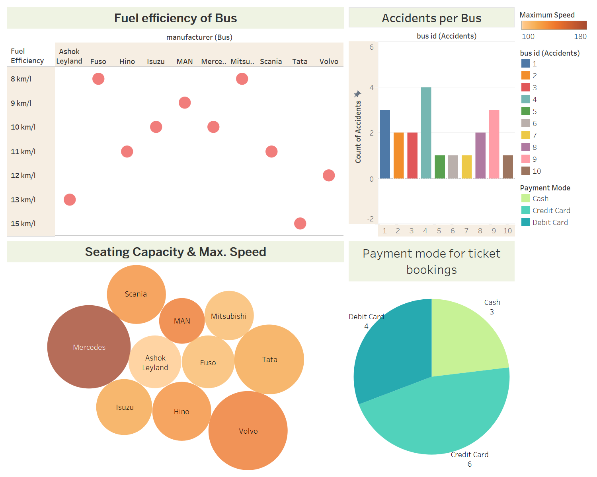

# Bus Transport Database Management System

In this project, we are going to design a database for a bus travel company, To
provide a centralized database for storing, managing and analyzing transportation data, including 
information on buses, routes, managing driver information and passenger information. We have also provided data on accidents occured by a particular driver and the location. The data would help company provide a better customer service and more efficient and safe travel.

## Entities

1. Bus - This entity mainly provides information about each bus such as the model, make, license plate number and seating capacity.

2. Maintainance - Information about maintainance performed on each bus including date, description and cost.

3. Schedule - Information about the departure and arrival times for each bus on each route.

4. Accident: Information about any accidents involving the buses, including the date, location, cause, and damage.

5. Driver: Information about each driver, such as their name, contact information, and driving record.

6. Route: Information about each route, such as the start and end points, stops along the way, and estimated travel time.

7. Booking Details: Information about the ticket such as the ticket_id and when the ticket was booked as well as payment status.

8. Passenger:  Information about each passenger, such as their name, contact information, and travel history.

9. City: Information about each city covered by the travel company such as city name and state it belongs to.

10. Ticket: Information about each ticket sold, such as the route, date, time, seat number, and fare.

11. Feedback:  Information about customer feedback, including ratings and comments about the buses, routes, and drivers.

12. Tracking: Information about the bus such as the bus ID, the route the bus is following, any alerts/notifications regarding the bus and next stop.

## Features

### Stored Procedure

1. Created a procedure to check if a bus is available on a particular date and time
2. Created a procedure to check if a bus is available for a particular route and date time
3. Created a procedure to perform CRUD operations on passenger entity
4. Created a procedure to perform CRUD operations on ticdket entity
5. Created a procedure to retrieve passenger details based on rating

### User Defined Function

1. Created a UDF to retrieve passenger information based on seat number
2. Created a UDF to retrieve information on how many times a bus has travelled in a month

### Trigger

1. Created a trigger to update booking details everytime a passenger books a ticket

### Column Encryption

1. Encrypt paassword column of the passenger

### Views

1. Created a view to retrive bus maintenance history
2. Created a view to retrieve Accident Details
3. Created a view to retrieve Bus Accident Count
4. Created a view to retrieve information about buses whose speed is above average
5. Created a view to retrieve information about all buses using diesel

### Non clustered indexes

1. Created a non clusered index on column bus_id in the maintenance entity
2. Created a non clustered index on Accident entity on date_time column
3. Created a non clusterede index on Tracking entity on the bus_id and route_id columns
4. Created a non clustered index on Passenger entity on the lastname column
5. Created a non clustered index on Ticket Entity on passenger_id column

### Table level Constraints

1. Created a constraint on Bus entity on seating_capacity column to make sure it is greater than 0
2. Created a constraint on Route entity on distance column and hours column to make sure it is greater than 0
3. Created a constraint on Ticket entity on price column to make sure it is greater than 0
4. Created a constraint on Passenger entity on zipcode column to make sure its length is 5 and length of phone number is 10
5. Created a constraint on Feedback entity on rating column to make sure it is between 1 and 5

